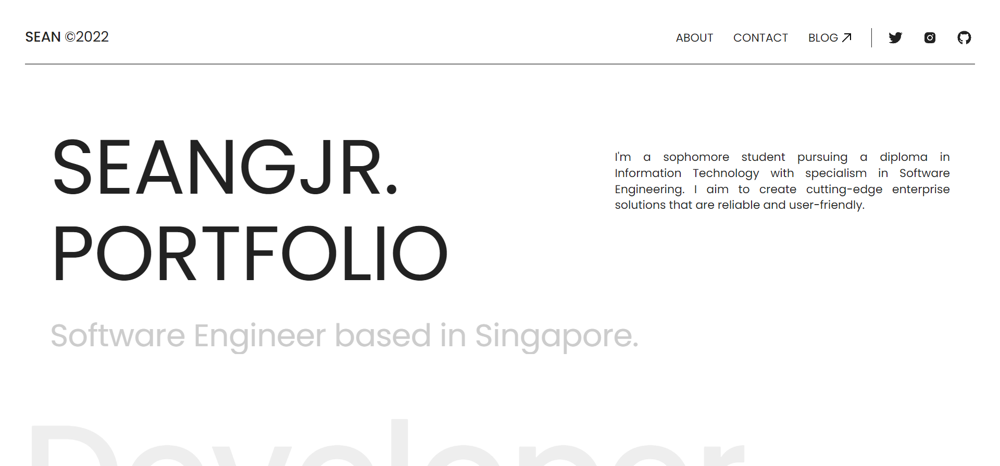

This is a portfolio website bootstrapped with [Next.js](https://nextjs.org/). Please feel free to use it as a template for your own portfolio website.

## Project Overview

This project is a portfolio website that I built to showcase my work and skills. It is built with Next.js, React, and Tailwind CSS. It is deployed on Vercel. The website is fully responsive and works on all screen sizes. It is also fully accessible and optimized for SEO.



## Project Structure

The project is structured as follows:
```
$PROJECT_ROOT
├── components
│   ├── hooks
│   ├── layout
│   ├── ...ts | tsx
├── pages
│   ├── _app.tsx
│   ├── [slug].tsx
│   ├── index.tsx
│   ├── ...ts | tsx
├── public
│   ├── images
│   ├── ...svg | png | jpg
├── styles
│   ├── **/*.scss
├── utils
```

## Project Stack

- [Next.js](https://nextjs.org/)
- [React](https://reactjs.org/)
- [Sass](https://sass-lang.com/)
